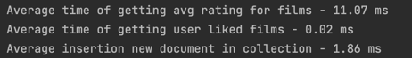

# Тестирование MongoDB

## Порядок запуска

### 1. Поднять БД

`docker-compose -f research_db/mongo/docker-compose.yml`

### 2. Сгенерировать данные

Запустить скрипт `research_db/mongo/src/data_loader.py`
Данный скрипт создаст БД, коллекцию и индексы в коллекции.

### 3. Выполнить тестирование чтения и записи

Запустить скрипт `research_db/mongo/src/main.py`

## Описание и результаты тестирования

После генерации данных в коллекции `likes` MongoDB насчитывается около
10 миллионов документов вида:
```json lines
{
    _id: ObjectId('643560775bc0d88483009555'),
    film_id: 'ab240345-8378-40df-8bfa-d645f8d0ea86',
    user_id: '1048e85a-2a2a-4929-8951-780a4c9ae64f',
    rating: 7
}
```
Списки ID пользователей и фильмов сохраняются в файл для удобства.

Количество объектов: 
- Пользователей - 1 млн. 
- Фильмов - 100 тыс.

Для каждого пользователя случайным образом выбирается от 0 до 20 фильмов для выставления оценки.

Тестировались:
1. Подсчет средней пользовательской оценки фильма
2. Получение понравившихся пользователю фильмов (оценка >= 9)
3. Время записи документа в коллекцию

На каждый тест приходилось по 100 прогонов.

Результаты тестирования на MacBook Air M1 представлены
в файле `research_db/mongo/src/results.csv`.



## Выводы

Скорость чтения и записи в MongoDB удовлетворяет требованию <= 200 мс.
Таким образом, MongoDB подходит как по времени записи, так и по времени чтения данных.
Для хранения UGC принято решение использовать MongoDB.